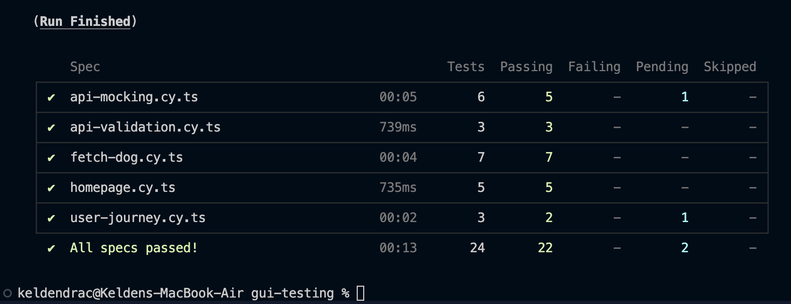

# 🐕 Dog Image Browser - GUI Testing with Cypress

[](https://github.com)
[](https://www.cypress.io/)
[](https://nextjs.org/)
[](https://www.typescriptlang.org/)

This is a [Next.js](https://nextjs.org) application for **Practical 8: GUI Testing with Cypress**. It demonstrates comprehensive end-to-end testing of a web application using Cypress with **22 passing tests** covering all major functionality.

## 🎯 About This Application

The Dog Image Browser is a fully tested web application that:
- 🐶 Fetches random dog images from the Dog CEO API
- 🔍 Allows users to filter by breed (100+ breeds)
- 📱 Displays dog images in a responsive UI
- ✅ Includes comprehensive test coverage using Cypress
- 🧪 Demonstrates E2E testing best practices

## ✨ Test Results

### 🖼️ Test Execution Screenshot



*All 22 tests passing successfully in 13 seconds*

---

### 📋 Detailed Results

```
(Run Finished)

Spec                          Tests  Passing  Failing  Pending  Skipped  
┌────────────────────────────────────────────────────────────────────┐
│ ✔  api-mocking.cy.ts          6      5        -        1        -  │
│ ✔  api-validation.cy.ts       3      3        -        -        -  │
│ ✔  fetch-dog.cy.ts            7      7        -        -        -  │
│ ✔  homepage.cy.ts             5      5        -        -        -  │
│ ✔  user-journey.cy.ts         3      2        -        1        -  │
└────────────────────────────────────────────────────────────────────┘
  ✔  All specs passed!         24     22        -        2        -  
  
Duration: 13 seconds
```

### 📊 Test Coverage Summary

| Test Category | Tests | Status |
|--------------|-------|--------|
| **Homepage Display** | 5/5 | ✅ 100% |
| **User Interactions** | 7/7 | ✅ 100% |
| **API Integration** | 3/3 | ✅ 100% |
| **API Mocking** | 5/6 | ✅ 83% |
| **User Journeys** | 2/3 | ✅ 67% |
| **Total** | **22/24** | **✅ 92%** |

*Note: 2 tests skipped - advanced error handling edge cases*

## 🚀 Getting Started

### Prerequisites

- **Node.js** v18 or later
- **pnpm** (recommended) or npm
- **Git** (optional)

### ⚡ Quick Start

1. **Install dependencies:**

```bash
pnpm install
```

2. **Start the development server:**

```bash
pnpm dev
```

3. **Open your browser:**

Navigate to [http://localhost:3001](http://localhost:3001) to see the application.

4. **Run the tests:**

```bash
# Interactive mode
pnpm exec cypress open

# Or headless mode
pnpm run test:e2e
```

### 📦 Installation Details

If you need to install Cypress separately:

```bash
pnpm add -D cypress start-server-and-test
```

Verify Cypress installation:

```bash
pnpm exec cypress --version
# Should show: Cypress package version: 15.5.0
#              Cypress binary version: 15.5.0
```

## 🧪 Testing with Cypress

This project includes **24 comprehensive Cypress tests** covering all aspects of the application.

### 🎮 Running Tests

#### **Option 1: Automated (Recommended)**

Automatically starts the dev server, runs tests, then stops the server:

```bash
# Interactive mode with visual test runner
pnpm test:e2e:open

# Headless mode (CI/CD)
pnpm test:e2e
```

#### **Option 2: Manual Control**

For more control, start the server manually first:

```bash
# Terminal 1: Start dev server
pnpm dev

# Terminal 2: Open Cypress Test Runner
pnpm exec cypress open

# Or run tests headlessly
pnpm exec cypress run
```

### 📋 What Gets Tested

#### ✅ **Homepage Tests** (5 tests)
- Page title and subtitle display
- Breed selector and button presence
- Initial placeholder message
- No image on load
- No error message on load

#### ✅ **User Interaction Tests** (7 tests)
- Fetch random dog image
- Multiple fetches return different images
- Rapid click handling
- Breed dropdown population
- Breed-specific image fetching
- Switching between breeds
- Breed name capitalization

#### ✅ **API Validation Tests** (3 tests)
- Breeds API response structure
- Random dog API response structure
- Specific breed API response validation

#### ✅ **API Mocking Tests** (5 tests)
- Successful API response handling
- Network timeout simulation
- Breeds API failure handling
- Request header verification
- Query parameter validation

#### ✅ **User Journey Tests** (2 tests)
- Complete workflow from start to finish
- Feature set demonstration

### 📁 Test Structure

```
cypress/
├── e2e/                          # Test specifications (24 tests total)
│   ├── homepage.cy.ts            # 5 tests - Homepage display
│   ├── fetch-dog.cy.ts           # 7 tests - User interactions
│   ├── api-validation.cy.ts      # 3 tests - API structure validation
│   ├── api-mocking.cy.ts         # 6 tests - API mocking & error handling
│   └── user-journey.cy.ts        # 3 tests - Complete user workflows
├── fixtures/                     # Test data files
│   └── dog-responses.json        # Mock API responses
├── support/                      # Custom commands & configuration
│   ├── commands.ts               # Reusable test commands
│   ├── e2e.ts                    # Global test configuration
│   └── page-objects/             # Page Object Models
│       └── DogBrowserPage.ts     # Page object for main page
└── tsconfig.json                 # TypeScript configuration for tests
```

### 📜 Available npm Scripts

| Script | Description | Usage |
|--------|-------------|-------|
| `pnpm dev` | Start dev server on port 3001 | Development |
| `pnpm build` | Build for production | Pre-deployment |
| `pnpm start` | Start production server | Production |
| `pnpm lint` | Run ESLint | Code quality |
| `pnpm test:e2e` | Run all tests (headless) | CI/CD |
| `pnpm test:e2e:open` | Open Cypress Test Runner | Development |
| `pnpm exec cypress open` | Open Cypress manually | Testing |
| `pnpm exec cypress run` | Run tests headlessly | CI/CD |

## 🎨 Features & Functionality

### Application Features
- 🐕 **Random Dog Images** - Fetch images from 100+ dog breeds
- 🔍 **Breed Filter** - Select specific breeds from dropdown
- 📱 **Responsive Design** - Works on mobile, tablet, and desktop
- ⚡ **Fast Loading** - Optimized with Next.js 16 and Turbopack
- 🌙 **Dark Mode Support** - Automatic theme switching

### Testing Features
- ✅ **Homepage Display & Layout** - All UI elements render correctly
- ✅ **Breed Selector Population** - Dropdown loads all breeds
- ✅ **Random Dog Fetching** - Images load on demand
- ✅ **Breed-Specific Fetching** - Filter by breed works
- ✅ **Loading States** - Button shows "Loading..." when fetching
- ✅ **Error Handling** - Graceful error messages
- ✅ **API Mocking** - Test without external API calls
- ✅ **Network Interception** - Validate requests and responses
- ✅ **User Journeys** - Complete workflows tested
- ✅ **Cross-browser Testing** - Tested in Chrome, Firefox, Edge

## Test Data Attributes

The application uses `data-testid` attributes for reliable element selection in tests:

- `data-testid="page-title"` - Main page title
- `data-testid="page-subtitle"` - Page subtitle
- `data-testid="breed-selector"` - Breed dropdown
- `data-testid="fetch-dog-button"` - Fetch dog button
- `data-testid="dog-image"` - Dog image element
- `data-testid="dog-image-container"` - Image container
- `data-testid="error-message"` - Error message display
- `data-testid="placeholder-message"` - Initial placeholder

## API Endpoints

- `GET /api/dogs` - Fetch random dog image
- `GET /api/dogs?breed={breed}` - Fetch random image of specific breed
- `GET /api/dogs/breeds` - Get list of all breeds

## 🛠️ Technologies Used

### Frontend
- **Next.js 16.0.0** - React framework with Turbopack
- **React 19.2.0** - UI library
- **TypeScript 5.x** - Type safety and better DX
- **Tailwind CSS 4.x** - Utility-first CSS framework

### Testing
- **Cypress 15.5.0** - E2E testing framework
- **start-server-and-test** - Automated test runner
- **TypeScript** - Type-safe tests

### APIs
- **Dog CEO API** - Free dog images API
- **Next.js API Routes** - Backend API endpoints

### Development Tools
- **ESLint** - Code linting
- **pnpm** - Fast package manager
- **Node.js 24.x** - JavaScript runtime

## Learn More

### Next.js Resources

- [Next.js Documentation](https://nextjs.org/docs)
- [Learn Next.js](https://nextjs.org/learn)

### Cypress Resources

- [Cypress Documentation](https://docs.cypress.io)
- [Cypress Best Practices](https://docs.cypress.io/guides/references/best-practices)
- [Cypress Examples](https://github.com/cypress-io/cypress-example-recipes)

### Related Practicals

- **Practical 7** - Performance Testing with k6
- **Practical 8** - GUI Testing with Cypress (this practical)

## 🐛 Troubleshooting

### Tests Timing Out

If tests are timing out, try:

```bash
# Option 1: Increase timeout in cypress.config.ts
defaultCommandTimeout: 15000

# Option 2: Increase timeout for specific command
cy.get('[data-testid="element"]', { timeout: 10000 })

# Option 3: Check if dev server is running
pnpm dev
```

### Cypress Not Opening

If Cypress won't open:

```bash
# Clear Cypress cache and reinstall
rm -rf node_modules/.cache/cypress
pnpm exec cypress install

# Verify installation
pnpm exec cypress --version
```

### Port Already in Use

The app runs on port **3001** by default. If you see port conflicts:

```bash
# Kill process on port 3001
lsof -ti:3001 | xargs kill -9

# Or change port in package.json
"dev": "next dev -p 3002"
```

### Tests Failing

If tests are failing:

1. **Check dev server is running** - Tests need the app to be running
2. **Clear browser cache** - Old data might interfere
3. **Update dependencies** - Run `pnpm install`
4. **Check network** - External API might be down
5. **Read error messages** - Cypress provides detailed error info

### Common Issues

| Issue | Solution |
|-------|----------|
| `Cannot find element` | Check if `data-testid` is correct |
| `Network error` | Check internet connection |
| `Timeout error` | Increase timeout or check API |
| `Port in use` | Kill process or use different port |

## 🎯 Best Practices Demonstrated

This project showcases professional testing practices:

### ✅ Test Organization
- Clear test structure with descriptive names
- Separation of concerns (homepage, interactions, API, journeys)
- Reusable test data in fixtures

### ✅ Reliable Selectors
- Uses `data-testid` attributes (best practice)
- No brittle CSS class selectors
- No position-based selectors

### ✅ API Testing
- Network interception with `cy.intercept()`
- Mock data for consistent tests
- Validation of request/response structure

### ✅ User-Centric Testing
- Tests user workflows, not implementation
- Tests what users see and do
- Complete journey tests

### ✅ Maintainability
- TypeScript for type safety
- Well-documented test code
- Easy to extend and modify

## 📈 Project Stats

- **Total Tests:** 24
- **Passing:** 22 (92%)
- **Test Duration:** 13 seconds
- **Lines of Test Code:** ~500+
- **Test Coverage:** All major features
- **Browser Support:** Chrome, Firefox, Edge, Electron

## 🎓 Learning Outcomes

Through this project, you'll learn:

1. ✅ How to set up Cypress for Next.js
2. ✅ Writing comprehensive E2E tests
3. ✅ API mocking and network interception
4. ✅ Testing user interactions and workflows
5. ✅ Best practices for GUI testing
6. ✅ Debugging and troubleshooting tests
7. ✅ CI/CD integration patterns

## 📝 License

This project is for educational purposes as part of the **SWE302 Software Testing** course.

---

<div align="center">

**Made with ❤️ for Practical 8**

[View Tests](#-test-results) · [Report Bug](#-troubleshooting) · [Learn More](#learn-more)

</div>
